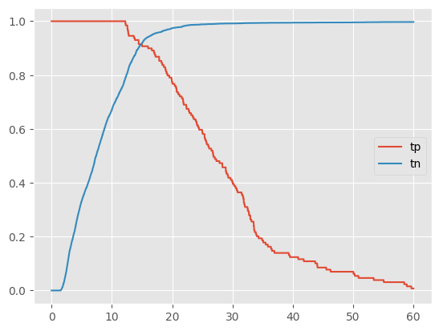
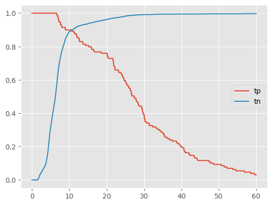
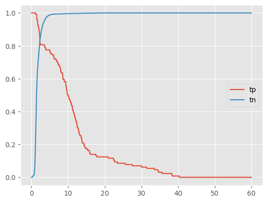
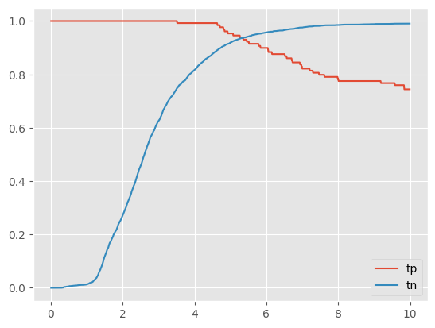

ФИО: Голдобин Илья

Предмет: Обработка и генерация изображений

Задача: построить модель (на основе автоэнкодера) определяющую состояние лунки пролив\не пролив.

Датасет: [вырезанные изображения лунок](https://drive.google.com/file/d/1DHuQ3DBsgab6NtZIZfAKUHS2rW3-vmtb/view?usp=sharing).

Для определения порога loss функции считаем loss и метрику True Positive Rate на валидационной выборке с проливами. Изображения с проливами в валидационной выборке отличаются от тех, что в тестовой (они часто бывают похожи на изображения без пролива и трешолд для теста должен быть меньше), поэтому выберем 0.9 квантиль из массива трешолдов (трешолды расположены по возрастанию), для которых True Positive Rate == 1.

Результаты обучения/Эксперименты:

1. [baseline(AE)](./AutoEncoder.ipynb)
    - Цель: обучить базовую модель
    - Идея: обучить AE из лекции
    - Результаты: True Positive Rate: 0.969, True Negative Rate: 0.816, Threshold: 12.619
    Есть диапазон значений threshold в котором метрики > 0.91: 14.69 - 15.00 
     
    - Выводы: обучена базовая модель

2. [VAE](./VariationalAutoEncoder.ipynb)
    - Цель: увеличить метрики
    - Идея: обучить VAE из лекции с модифицированной loss функцией относительно baseline
    - True Positive Rate: 0.88, True Negative Rate: 0.91, Threshold: 17.317
    Метрики почти удовлетворительные, диапазона значений threshold в котором метрики > 0.91 нет
     
    - Выводы: Метрики улучшились, почти достигают требований, интересно добавить в модель свертки

3. [AE со сверткой](./ConvAutoencoder.ipynb)
    - Цель: увеличить метрики
    - Идея: добавить сверточные слои
    - Результаты: True Positive Rate: 0.84, True Negative Rate: 0.83, Threshold: 2.3680000000000003
    Метрики ухудшились, диапазона значений threshold в котором метрики > 0.91 нет
     
    - Выводы: Метрики упали, возможно из-за отсутствия полносвязных слоев в bottleneck и из-за двумерного скрытого пространства

4. [Своя модель AE со сверткой](./MyModel.ipynb)
    - Цель: увеличить метрики
    - Идея: упростим AE со сверткой, добавим полносвязные слои
    - Результаты: удалось добиться того, чтобы True_positive_rate и True_negative_rate одновременно были более 91%
    True Positive Rate: 0.938, True Negative Rate: 0.941, Threshold: 5.653000000000001
    Диапазон значений threshold в котором метрики > 0.91: 4.87 - 5.78
     
    - Выводы: Удалось одновременно превысить значение 0.91 по метрикам True_positive_rate и True_negative_rate
