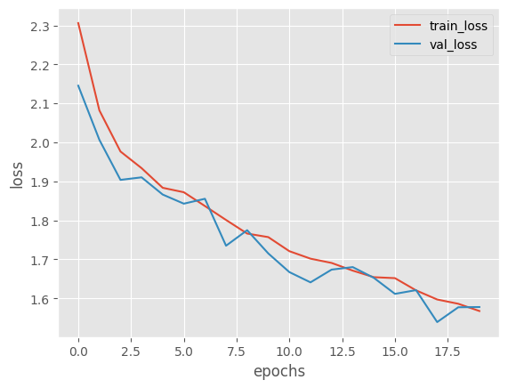
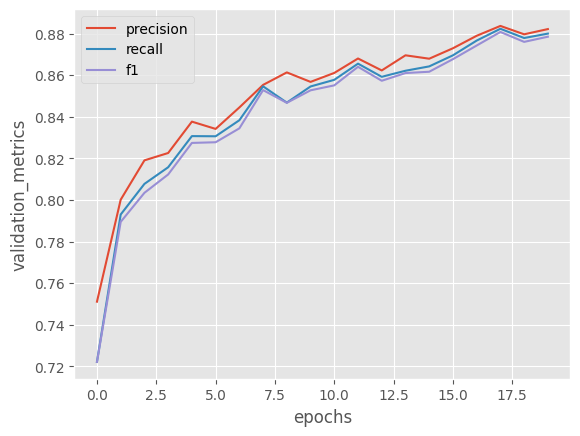
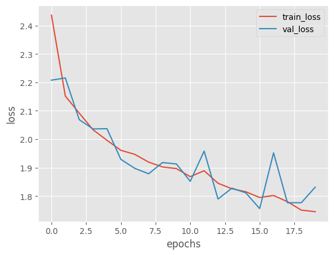
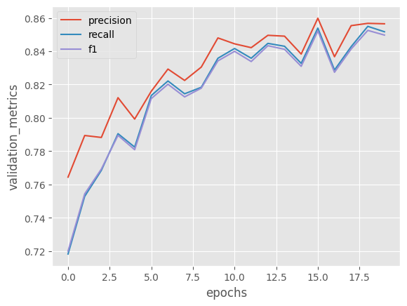
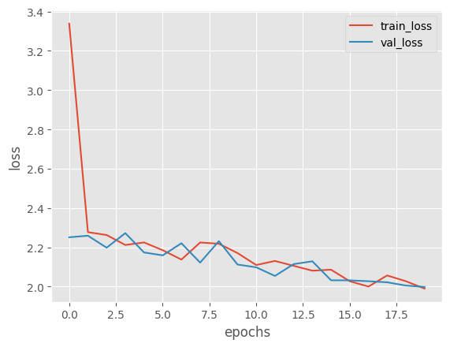
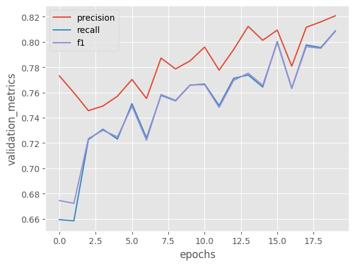

ФИО: Голдобин Илья

Предмет: Обработка и генерация изображений

Задача: Множественная классификация объектов (10 классов)

Классы:

- plane
- car
- bird
- cat
- deer
- dog
- frog
- horse
- ship
- truck

Датасет: CIFAR-10

Архитектура: ResNet-50

Гиперпараметры:
- batch size: 128
- optimizer: SGD
- learning rate: 0.001
- momentum: 0.9
- loss: cross-entropy
- device: cuda
- epochs: 20

Эксперименты:
1. 100 % датасета
    - Лоссы в обучении
        - 
        - 
    - Метрики в обучении
        - 
        - 
2. 100 % датасета
    - Лоссы в обучении
        - 
        - 
    - Метрики в обучении
        - 
        - 
3. 100 % датасета
    - Лоссы в обучении
        - 
        - 
    - Метрики в обучении
        - 
        - 

Вывод:
Во всех экспериментах модель с рандомно инициализированным feature extractor обучается быстрее и достигает больших метрик на валидации