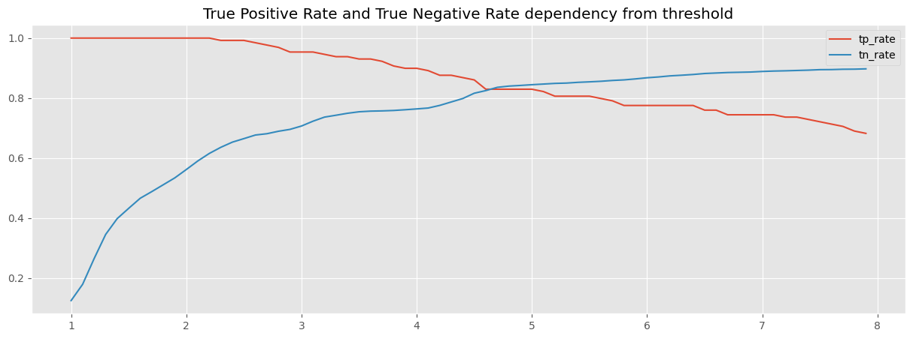
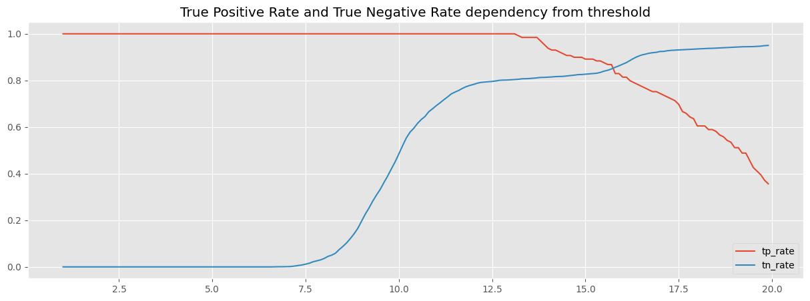

ФИО: Голдобин Илья

Предмет: Обработка и генерация изображений

Задача: построить модель (на основе автоэнкодера) определяющую состояние лунки пролив\не пролив.

Датасет: [вырезанные изображения лунок](https://drive.google.com/file/d/1DHuQ3DBsgab6NtZIZfAKUHS2rW3-vmtb/view?usp=sharing).

Результаты обучения/Эксперименты:

1. baseline (AE)
    - Цель: обучить базовую модель
    - Идея: обучить AE из лекции (20 эпох, размерность скрытого пространства 16)
    - Результаты: не удалось добиться того, чтобы True_positive_rate и True_negative_rate одновременно были более 91%
    threshold = 4.70: True Positive Rate: 0.83, True Negative Rate: 0.84
     
    - Выводы: обучена базовая модель

2. VAE
    - Цель: увеличить метрики
    - Идея: обучить VAE из лекции с модифицированной loss функцией относительно baseline (20 эпох, размерность скрытого пространства 16)
    - Результаты: не удалось добиться того, чтобы True_positive_rate и True_negative_rate одновременно были более 91%
    threshold = 15.70: True Positive Rate: 0.87, True Negative Rate: 0.85
     
    - Выводы: Метрики немного подросли по сравненению с baseline