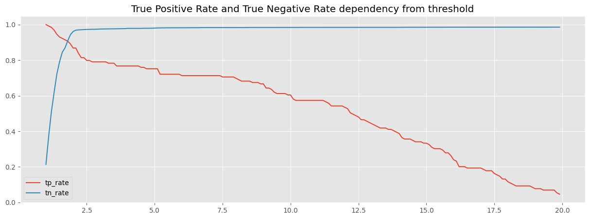
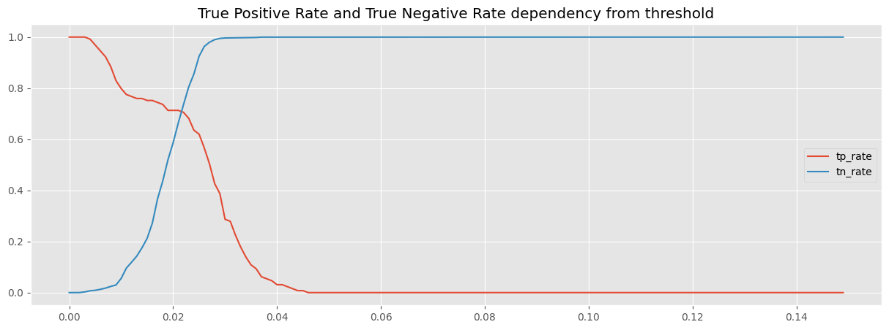

ФИО: Голдобин Илья

Предмет: Обработка и генерация изображений

Задача: построить модель (на основе автоэнкодера) определяющую состояние лунки пролив\не пролив.

Датасет: [вырезанные изображения лунок](https://drive.google.com/file/d/1DHuQ3DBsgab6NtZIZfAKUHS2rW3-vmtb/view?usp=sharing).

Результаты обучения/Эксперименты:

1. baseline (AE)
    - Цель: обучить базовую модель
    - Идея: обучить AE из лекции (20 эпох, размерность скрытого пространства 16)
    - Результаты: не удалось добиться того, чтобы True_positive_rate и True_negative_rate одновременно были более 91%
    threshold = 4.70: True Positive Rate: 0.83, True Negative Rate: 0.84
     
    - Выводы: обучена базовая модель

2. VAE
    - Цель: увеличить метрики
    - Идея: обучить VAE из лекции с модифицированной loss функцией относительно baseline (20 эпох, размерность скрытого пространства 16)
    - Результаты: не удалось добиться того, чтобы True_positive_rate и True_negative_rate одновременно были более 91%
    threshold = 15.70: True Positive Rate: 0.87, True Negative Rate: 0.85
     
    - Выводы: Метрики немного подросли по сравненению с baseline

3. AE со сверткой
    - Цель: увеличить метрики
    - Идея: обучить AE со сверточными слоями
    - Результаты: не удалось добиться того, чтобы True_positive_rate и True_negative_rate одновременно были более 91%
    threshold = 1.80: True Positive Rate: 0.91, True Negative Rate: 0.91
     
    - Выводы: Метрики немного подросли по сравненению с VAE, почти удалось превзойти 0.91

4. VAE со сверткой
    - Цель: увеличить метрики
    - Идея: обучить VAE со сверточными слоями
    - Результаты: не удалось добиться того, чтобы True_positive_rate и True_negative_rate одновременно были более 91%
    Мектрики упали
     
    - Выводы: Метрики самые низкие из всех опробованных моделей, модель слишком сложная

5. Упрощенный VAE со сверткой
    - Цель: увеличить метрики
    - Идея: упростить модель VAE со сверткой: в энкодере будет 1 сверточный слой, в декодере 1 полносвязный слой, лосс - MSE
    - Результаты: удалось добиться того, чтобы True_positive_rate и True_negative_rate одновременно были более 91%
    threshold = 0.0017: True Positive Rate: 0.98, True Negative Rate: 0.92
    threshold = 0.0018: True Positive Rate: 0.97, True Negative Rate: 0.94
    threshold = 0.0019: True Positive Rate: 0.95, True Negative Rate: 0.95
    threshold = 0.0020: True Positive Rate: 0.95, True Negative Rate: 0.95
    threshold = 0.0021: True Positive Rate: 0.91, True Negative Rate: 0.96
     
    - Выводы: Удалось одновременно превысить значение 0.91 по метрикам True_positive_rate и True_negative_rate при значении threshold из списка [0.0017, 0.0018, 0.0019, 0.002, 0.0021]
