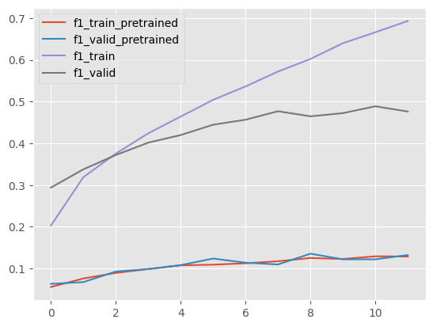

ФИО: Голдобин Илья

Предмет: Обработка и генерация изображений

Задача: Множественная классификация объектов (10 классов)

Классы:

- plane
- car
- bird
- cat
- deer
- dog
- frog
- horse
- ship
- truck

Датасет: CIFAR-10

Архитектура backbone: ResNet-50

Эксперименты:
1. 100 % датасета
    - Лоссы в обучении
    
    - Метрики в обучении
        - F1
        
        - Precision
        
        - Recall
        
2. 50 % датасета
    - Лоссы в обучении
    
    - Метрики в обучении
        - F1
        
        - Precision
        
        - Recall
        
3. 10 % датасета
    - Лоссы в обучении
    
    - Метрики в обучении
        - F1
        
        - Precision
        
        - Recall
        

Вывод:
Во всех экспериментах модель с рандомно инициализированным весами обучается быстрее и достигает больших метрик на валидации и тесте
Модель с предобученным feature extractor показала себя хуже. Причина, скорее всего в недостатке self supervised обучения, так как авторы метода в статье указали, что для ResNet-50 они использовали batchsize 4096 и обучали 1000 эпох, что заняло 8 часов, чтобы получить высокие метрики на CIFAR-10. Также, возможно, стоило добавить в аугментации crop.